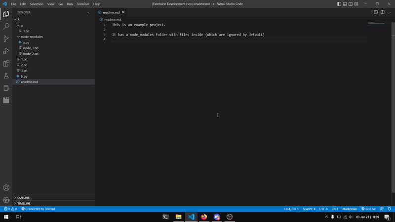

# vs-tab-groups

Create and manage tab groups to improve your development workflow.

Extension available at [https://marketplace.visualstudio.com/items?itemName=bentodaniel.vs-tab-groups](https://marketplace.visualstudio.com/items?itemName=bentodaniel.vs-tab-groups)

## Features

- Create file groups
- Remove file groups
- Add files to a group
- Remove files from a group
- Open a group, i.e., all associated files, in the editor
- Close a group of files previously opened in the editor

Workspace's tab groups are saved automatically, so you have them ready when you come back to your work.

## Extension Settings

This extension contributes the following settings:

* `vs-tab-groups.replaceTabGroups`: If true, when opening a tab group, all other open tab groups in the editor will be replaced. If false, the new tab group will be opened, keeping all other tabs in the editor.
* `vs-tab-groups.ignorePaths`: Configure patterns to ignore files and folders when adding files to groups.
* `vs-tab-groups.expandLevel`: Configure depth of expansion of groups. (Note that, currently there is only 1 level of depth so changing this value will have no influence).

## Known Issues

- Must open a folder to create groups. It is not possible to create groups of individual files.
- When trying to add files to a group, a tab must be opened. VSCode uses this tab's file path to identify the path to the open folder.
- When opening a tab group for the first time, it may not open all tabs. This only happens once, therefore, it is not a big issue.

## Release Notes

### 1.3.0
Added:
  - Option to rename Tab Groups;

### 1.2.0
Resolved:
  - Option in the "More Actions..." button to sync the order of the open tabs to a tab group (if they belong to that group already);
  - Bug where the name of the extension was not showing;

### 1.0.1

Resolve requests:
  - expand and collapse all tab groups;
  - actions to add current tab or all open tabs to tab group or create a new group;

### 1.0.0

Initial release of `VS Tab Groups`

---

**Hope you find this extension useful!**
